# Catálogo Bibliotecario en Línea — Biblioteca ESET-UNQ

---

**Institución:** ESET-UNQ

**Autores:** Pedro Iglesias Merediz, Noel Rosa Flores y Benjamin Gonzalez

---

## Índice

1. [Introducción](#1-introducción)
2. [Alcance del proyecto](#2-alcance-del-proyecto)
3. [Planificación y decisiones tecnológicas](#3-planificación-y-decisiones-tecnológicas)
4. [Diseño del modelo de datos](#4-diseño-del-modelo-de-datos)
5. [Configuración inicial del proyecto](#5-configuración-inicial-del-proyecto)
6. [Panel de administración para bibliotecarios](#6-panel-de-administración-para-bibliotecarios)
7. [Catálogo público](#7-catálogo-público)
8. [Modos de visualización del catálogo](#8-modos-de-visualización-del-catálogo)
9. [Módulo de importación y exportación de datos](#9-módulo-de-importación-y-exportación-de-datos)

---

## 1. Introducción

El presente documento describe el proceso de desarrollo de un sistema de catálogo bibliotecario en línea destinado a la Biblioteca ESET-UNQ. El proyecto surge de la necesidad concreta de digitalizar y centralizar el acervo bibliográfico de la institución, que hasta el momento de inicio del desarrollo se administraba de forma manual o mediante herramientas no especializadas, sin una interfaz accesible para los usuarios ni un mecanismo estructurado de gestión para los bibliotecarios.

El sistema desarrollado tiene como propósito principal permitir que los bibliotecarios a cargo gestionen el catálogo de la institución —incorporando, editando y organizando el material disponible— mediante un panel de administración dedicado, al tiempo que ofrece a los usuarios (alumnos, docentes y público en general) una interfaz de consulta pública, accesible sin necesidad de autenticación, a través de la cual puedan buscar y explorar el material disponible.

El desarrollo se llevó a cabo de forma iterativa, incorporando funcionalidades de manera progresiva a medida que las necesidades del sistema fueron siendo definidas y refinadas. Esta documentación refleja ese proceso en su orden cronológico real, incluyendo tanto las decisiones técnicas adoptadas como los inconvenientes encontrados durante el desarrollo y la forma en que fueron resueltos.

---

## 2. Alcance del proyecto

El sistema cubre las siguientes funcionalidades en su versión actual:

- Gestión completa del catálogo bibliográfico (alta, modificación y baja lógica de libros) desde un panel de administración restringido a usuarios autenticados.
- Gestión de entidades relacionadas: autores, categorías y editoriales.
- Catálogo público de consulta en línea, con búsqueda por texto libre, filtrado por categoría y ordenamiento configurable.
- Dos modos de visualización del catálogo público: vista en cuadrícula y vista en lista, seleccionables por el usuario.
- Módulo de importación masiva de libros desde archivos Excel (.xlsx), con creación automática de autores y categorías inexistentes.
- Módulo de exportación del catálogo completo o filtrado hacia archivos Excel (.xlsx), utilizando el mismo formato de columnas que la importación.

Quedan deliberadamente fuera del alcance de esta primera etapa las siguientes funcionalidades, que podrán incorporarse en versiones posteriores: el sistema de préstamos y devoluciones a alumnos, las notificaciones automáticas, la gestión de usuarios con roles diferenciados por nivel (por ejemplo, distinción entre bibliotecario y administrador), y la integración directa con servicios externos de metadatos bibliográficos como Google Books u Open Library.

---

## 3. Planificación y decisiones tecnológicas

### 3.1 Elección del framework

Al inicio del proyecto se evaluaron distintas alternativas tecnológicas para el desarrollo del sistema. La decisión más relevante fue la elección del lenguaje de programación y el framework principal. Se consideraron dos opciones: un stack basado en JavaScript con Next.js en el lado del servidor, y un stack basado en Python con Django. La elección recayó sobre Django por una razón práctica y determinante para el contexto del proyecto: Django incorpora de forma nativa un panel de administración completamente funcional, que permite gestionar los modelos de datos del sistema (crear, editar y eliminar registros) con un mínimo de código adicional. Dado que una parte central del sistema es precisamente la interfaz de carga y gestión de libros por parte de los bibliotecarios, esto representaba una ventaja concreta en términos de tiempo de desarrollo.

### 3.2 Arquitectura general

La arquitectura adoptada corresponde a una aplicación web monolítica, sin separación entre frontend y backend como servicios independientes. Esta decisión fue deliberada: para una biblioteca escolar de escala acotada, una arquitectura más simple resulta más fácil de mantener, desplegar y documentar que una arquitectura distribuida de microservicios o una separación API REST con frontend independiente. Django maneja tanto la lógica del servidor como la generación de las vistas HTML mediante su sistema de plantillas (templates), lo que permite un flujo de desarrollo cohesionado y sin duplicación de capas.

La base de datos utilizada durante el desarrollo es SQLite, que Django configura por defecto y que resulta suficiente para entornos de desarrollo local. Para un despliegue en producción se prevé la migración a PostgreSQL, para lo cual ya se instaló el conector correspondiente (`psycopg2`) desde el inicio del proyecto.

### 3.3 Stack tecnológico completo

| Componente | Tecnología |
|---|---|
| Framework principal | Django 6.x |
| Lenguaje | Python 3.13 |
| Base de datos (desarrollo) | SQLite |
| Base de datos (producción prevista) | PostgreSQL |
| Interfaz del panel de administración | django-unfold |
| Importación y exportación | django-import-export |
| Procesamiento de imágenes | Pillow |
| Manejo de archivos Excel | openpyxl |
| Frontend del catálogo público | Django Templates + Bootstrap 5 |
| Tipografía | Inter (Google Fonts) |

---

## 4. Diseño del modelo de datos

El diseño del modelo de datos fue uno de los primeros pasos del desarrollo, previo a la escritura de cualquier vista o plantilla. Se identificaron cuatro entidades principales: **Libro**, **Autor**, **Categoría** y **Editorial**, con las siguientes relaciones entre ellas.

Un libro puede tener uno o más autores (relación de muchos a muchos), puede pertenecer a una única categoría (relación de uno a muchos, con valor nulo permitido) y puede estar asociado a una o varias editoriales (relación de muchos a muchos). Esta estructura permite representar correctamente obras con autoría múltiple y publicaciones reeditadas por distintas editoriales.

El modelo `Libro` concentra los campos principales del registro bibliográfico: título, ISBN, año de publicación, descripción o sinopsis, ubicación física dentro de la biblioteca (campo de texto libre que permite indicar el estante y la fila donde se encuentra el ejemplar), cantidad de ejemplares disponibles, imagen de portada, imagen de contraportada, fecha de ingreso al sistema (generada automáticamente) y un campo booleano `activo` que permite realizar bajas lógicas sin eliminar el registro de la base de datos, preservando la integridad histórica del catálogo.

Esta decisión de utilizar bajas lógicas en lugar de eliminación física fue tomada desde el diseño inicial, considerando que en un sistema bibliotecario es frecuente que un libro sea retirado temporalmente del catálogo activo pero deba conservarse su registro para fines administrativos o históricos.

---

## 5. Configuración inicial del proyecto

### 5.1 Estructura del proyecto

La estructura de directorios adoptada sigue las convenciones estándar de Django, con una separación clara entre la configuración global del proyecto (carpeta `config/`) y la aplicación principal que contiene la lógica del catálogo (carpeta `catalogo/`). Dentro de la aplicación, se organizaron los archivos de plantillas HTML bajo `catalogo/templates/catalogo/` y los archivos estáticos bajo `catalogo/static/catalogo/`, respetando la convención de Django de incluir el nombre de la aplicación como subdirectorio intermedio para evitar colisiones entre aplicaciones.

### 5.2 Inconvenientes durante la configuración

Durante la etapa de configuración inicial se presentó un inconveniente relacionado con las migraciones de la base de datos. En un momento del desarrollo, al realizar modificaciones en el modelo `Libro` (específicamente al agregar el campo `contraportada`), se generaron migraciones en conflicto: una migración intentaba eliminar una columna que aún no existía en la base de datos, lo cual producía un error de tipo `OperationalError` al ejecutar `migrate`. La causa raíz fue la acumulación de migraciones parciales generadas en distintos momentos del desarrollo sin haber aplicado las anteriores correctamente.

La resolución consistió en eliminar todos los archivos de migración existentes (conservando únicamente el archivo `__init__.py`), eliminar la base de datos SQLite de desarrollo (cuya pérdida no representaba un problema en esta etapa), y regenerar las migraciones desde cero a partir del estado actual del modelo. Este procedimiento, válido en entornos de desarrollo donde no existe información productiva en la base de datos, permitió restablecer la consistencia entre el modelo de datos definido en el código y el esquema real de la base de datos.

---

## 6. Panel de administración para bibliotecarios

### 6.1 Modernización visual con django-unfold

El panel de administración nativo de Django, si bien es funcional, presenta una interfaz visual datada que no resulta adecuada para un sistema de uso cotidiano por parte de los bibliotecarios. Para resolver esto se incorporó la librería `django-unfold`, que reemplaza la interfaz visual del admin de Django manteniendo toda su funcionalidad, pero con un diseño moderno, oscuro y con tipografía y componentes actualizados. La integración requirió colocar `unfold` antes de `django.contrib.admin` en la lista de aplicaciones instaladas en `settings.py`, condición necesaria para que Unfold pueda sobreescribir correctamente las plantillas del admin nativo.

### 6.2 Acceso al panel

El acceso al panel de administración está restringido a usuarios con credenciales de bibliotecario o administrador del sistema. Desde el catálogo público, un enlace discreto en la barra de navegación superior permite a los bibliotecarios acceder al formulario de autenticación.

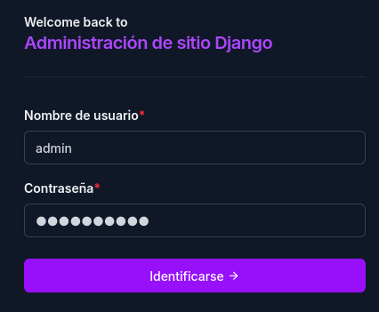
*Figura 1. Formulario de autenticación del panel de administración, con la interfaz visual provista por django-unfold.*

### 6.3 Estructura del panel

Una vez autenticado, el bibliotecario accede a la pantalla principal del panel, que organiza las entidades gestionables en una sección denominada **Catalogo**, compuesta por cuatro modelos: Autores, Categorías, Editoriales y Libros. Además de esta sección, el panel expone la sección de **Autenticación y Autorización** nativa de Django, que permite gestionar los usuarios del sistema.

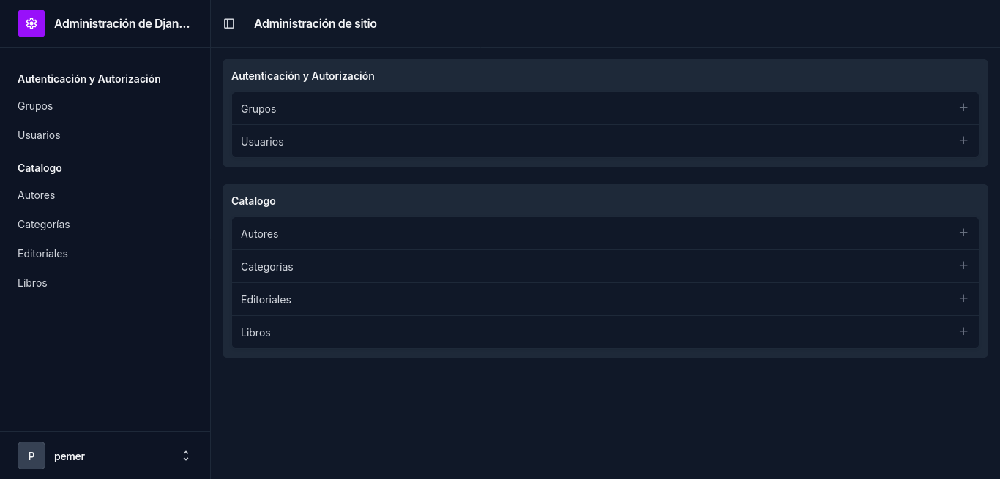
*Figura 2. Pantalla principal del panel de administración, con las entidades del catálogo organizadas en la sección correspondiente.*

### 6.4 Gestión de entidades auxiliares

Antes de poder registrar un libro en el sistema, es necesario que los autores, categorías y editoriales correspondientes existan en la base de datos. El panel de administración provee formularios independientes para cada una de estas entidades. El formulario de autores solicita el nombre completo y el país de origen del autor; el de categorías y el de editoriales solicitan únicamente el nombre.

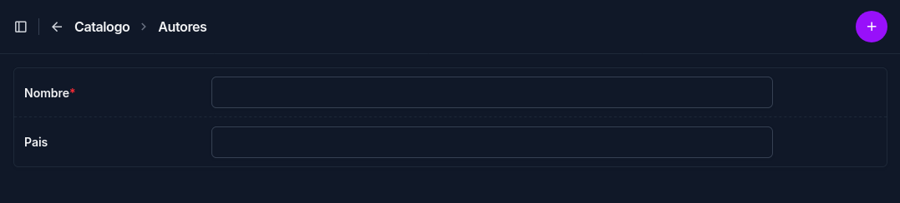
*Figura 3. Formulario de alta de un nuevo autor en el sistema.*

*Figura 4. Formulario de alta de una nueva categoría.*

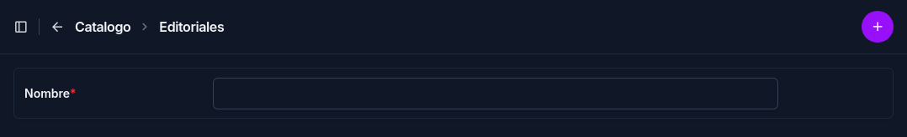
*Figura 5. Formulario de alta de una nueva editorial.*

### 6.5 Gestión de libros

El formulario de alta y edición de libros es el componente central del panel de administración. Está organizado en cuatro secciones diferenciadas: **Información principal** (título, autores, categoría, portada y contraportada), **Detalles de publicación** (ISBN, editoriales, año de publicación y descripción), **Información física** (ubicación dentro de la biblioteca y cantidad de ejemplares) y **Estado** (campo activo para controlar la visibilidad del libro en el catálogo público).

El campo de autores y el de editoriales utilizan un selector de tipo "horizontal filter" que permite asignar múltiples valores mediante una interfaz de dos columnas: disponibles y seleccionados. El campo `activo` se presenta como un interruptor visual, lo cual permite al bibliotecario activar o desactivar un libro del catálogo de forma rápida e intuitiva.

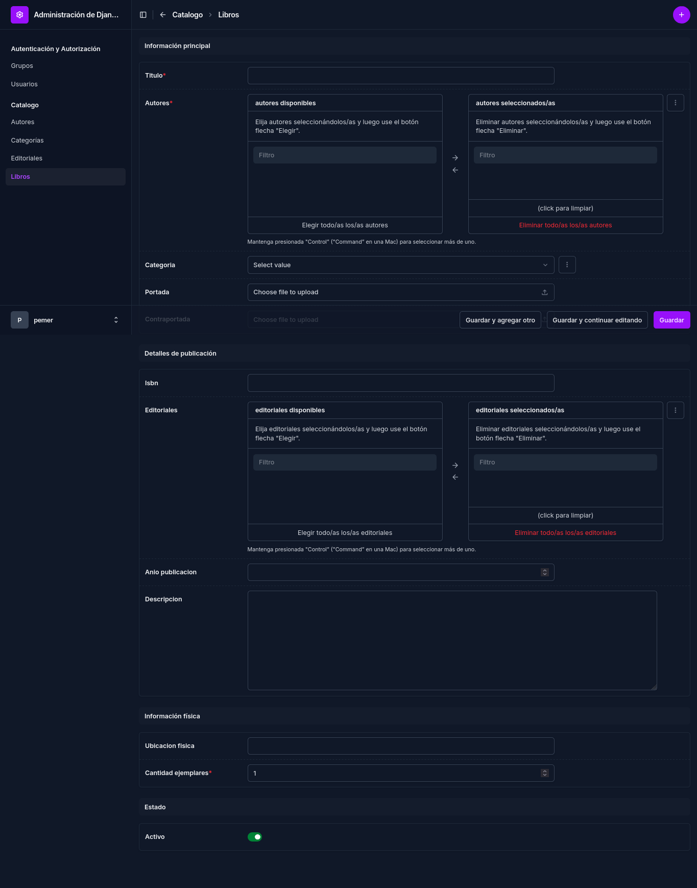
*Figura 6. Formulario completo de alta de un nuevo libro, con todas sus secciones desplegadas.*

---

## 7. Catálogo público

### 7.1 Criterios de diseño

El catálogo público es la interfaz destinada a los usuarios finales del sistema: alumnos, docentes y cualquier persona que desee consultar el acervo de la biblioteca. Esta sección es accesible sin necesidad de autenticación, condición fundamental para garantizar la accesibilidad del catálogo. El diseño visual fue concebido para mantener coherencia estética con el panel de administración: se utilizaron las mismas variables de color (rojo institucional `#a30000`, fondos claros cálidos y tipografía Inter) para generar una experiencia visualmente unificada entre ambas secciones del sistema.

La barra de navegación superior muestra el nombre de la institución y, de forma diferenciada según el estado de sesión del usuario, un enlace de acceso al panel para bibliotecarios autenticados o un botón discreto de "Acceso bibliotecarios" para usuarios no identificados. Cuando el usuario ha iniciado sesión, la barra expone también accesos directos al panel de administración y al formulario de carga rápida de libros.

### 7.2 Funcionalidades de búsqueda y filtrado

El catálogo ofrece tres mecanismos de navegación combinables: búsqueda por texto libre (que consulta simultáneamente el título, los nombres de los autores y el ISBN del libro), filtrado por categoría mediante un selector desplegable, y ordenamiento configurable por título (ascendente o descendente), año de publicación (ascendente o descendente) y autor (ascendente o descendente). Estos parámetros se transmiten como argumentos en la URL mediante el método GET, lo que permite que el estado de búsqueda sea compartible y reproducible: una URL con parámetros de búsqueda activos puede ser copiada y compartida, y al acceder a ella se obtendrá el mismo resultado.

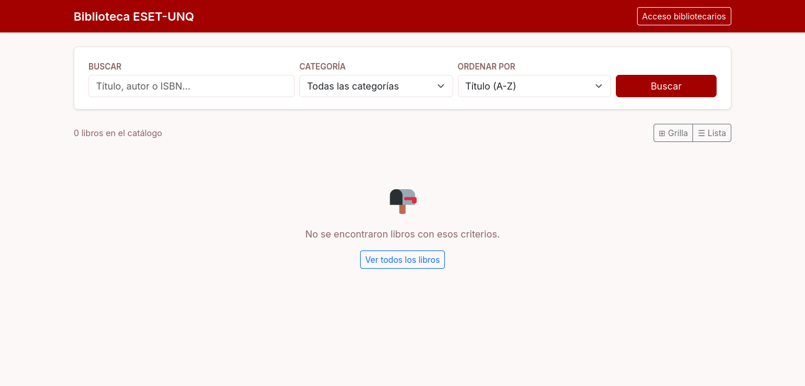
*Figura 7. Interfaz del catálogo público en estado inicial, mostrando la barra de búsqueda, los filtros y el selector de modo de visualización.*

### 7.3 Inconveniente en la implementación de las plantillas

Durante el desarrollo del catálogo público se presentó un error relacionado con la herencia de plantillas de Django. El sistema de plantillas de Django permite que una plantilla "hija" extienda a una plantilla "base" mediante la directiva ``. Por error, el contenido de la plantilla hija (`catalogo_publico.html`) fue copiado dentro del archivo base (`base_publica.html`), lo que generó una situación de recursión: la base intentaba extenderse a sí misma, produciendo un error de tipo `TemplateDoesNotExist` acompañado de la advertencia "Skipped to avoid recursion". La resolución consistió en restablecer el contenido correcto en cada archivo, verificando que el archivo base no contuviera la directiva `` en ningún punto.

---

## 8. Modos de visualización del catálogo

### 8.1 Vista en cuadrícula

La vista en cuadrícula es el modo de visualización por defecto del catálogo. Presenta los libros organizados en una grilla responsiva de cinco columnas en pantallas anchas, que se reduce progresivamente hasta dos columnas en dispositivos móviles. Cada tarjeta muestra la portada del libro (o un indicador de ausencia de imagen cuando no se ha cargado portada), el título, el nombre del autor o autores y la categoría correspondiente. Este modo prioriza la imagen de portada como elemento central de reconocimiento del material.

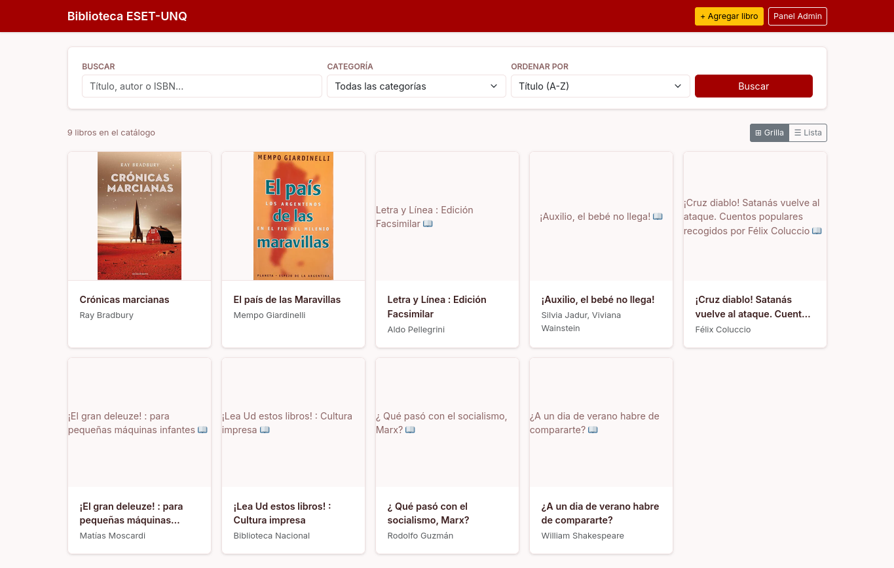
*Figura 8. Catálogo público en modo de visualización en cuadrícula, con nueve libros disponibles.*

### 8.2 Vista en lista

La vista en lista presenta los mismos libros de forma vertical, con una fila por libro, combinando la imagen de portada en miniatura con un mayor volumen de información textual: título, autor, categoría, descripción del libro (truncada a dos líneas), y una fila de metadatos que incluye editorial, año de publicación, ISBN, ubicación física y cantidad de ejemplares disponibles. Este modo resulta especialmente útil cuando el usuario busca comparar características específicas de varios libros o cuando desea acceder a información de localización física sin necesidad de ingresar a la vista de detalle de cada libro.

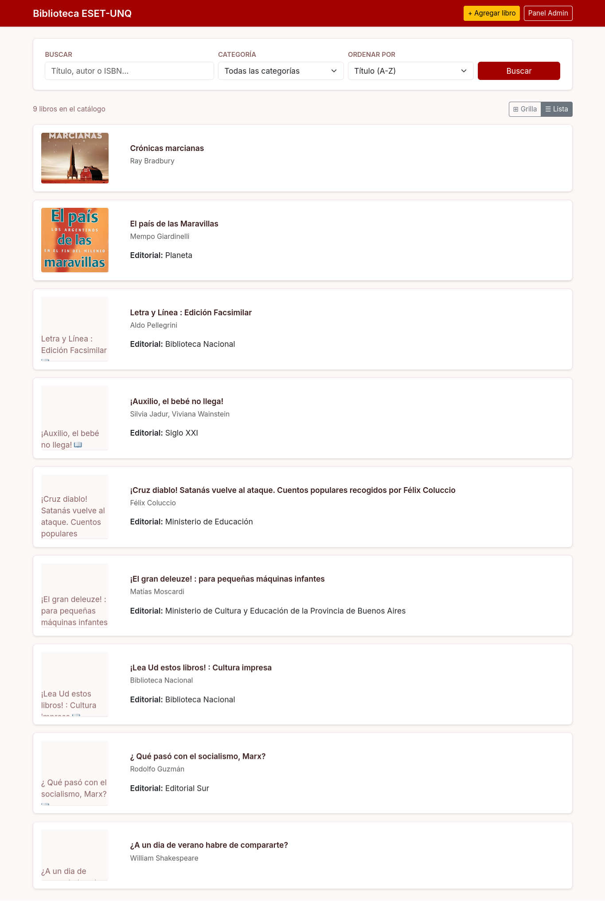
*Figura 9. Catálogo público en modo de visualización en lista, mostrando información extendida de cada libro.*

### 8.3 Implementación del selector de vista y error encontrado

El mecanismo de selección entre ambos modos de visualización se implementó mediante un parámetro GET en la URL (`?vista=grilla` o `?vista=lista`), de modo análogo a como funcionan los parámetros de búsqueda y filtrado. Un selector visual en la barra de resultados permite al usuario alternar entre los dos modos manteniendo activos los filtros de búsqueda y categoría que hubiera aplicado previamente.

Durante la implementación se presentó un error que impidió el correcto funcionamiento del selector durante las pruebas iniciales: el parámetro `vista`, aunque era calculado correctamente en la función de vista (`views.py`), no estaba siendo incluido en el diccionario de contexto que se pasaba al motor de plantillas en la llamada a `render()`. Como consecuencia, la variable llegaba vacía al template, la condición `` evaluaba siempre como falsa, y el sistema renderizaba invariablemente el bloque de lista independientemente del valor seleccionado. La resolución fue sencilla una vez identificada la causa: agregar `'vista': vista` al diccionario de contexto del `return render()`.

---

## 9. Módulo de importación y exportación de datos

### 9.1 Contexto y motivación

La carga manual de libros uno por uno resulta viable para el mantenimiento cotidiano del catálogo, pero se convierte en un cuello de botella cuando se requiere migrar un catálogo preexistente de considerable volumen hacia el sistema, o cuando se necesita realizar actualizaciones masivas de información bibliográfica. Para resolver esta necesidad se desarrolló un módulo de importación y exportación de datos integrado directamente en el panel de administración, que permite al bibliotecario cargar un archivo Excel con múltiples registros y procesarlos de forma automática, así como exportar el catálogo completo (o un subconjunto filtrado) hacia un archivo Excel descargable.

### 9.2 Herramienta utilizada

La funcionalidad fue implementada mediante la librería `django-import-export`, que se integra de forma nativa con el panel de administración de Django y cuenta con soporte explícito para django-unfold, garantizando que los botones y formularios de importación y exportación respeten la estética visual del panel. La integración se realizó modificando la clase `LibroAdmin` en el archivo `admin.py` para que herede de `ImportExportModelAdmin` en lugar de la clase base estándar, y creando un archivo `resources.py` que define la lógica de mapeo entre las columnas del archivo Excel y los campos del modelo `Libro`.

### 9.3 Formato del archivo de intercambio

Se definió un formato de columnas estándar, tanto para la importación como para la exportación, de modo que un archivo generado mediante la función de exportación pueda ser utilizado directamente como plantilla para una reimportación posterior sin necesidad de reformatear las columnas. Las columnas establecidas son, en orden: Titulo, Autores, Categoria, Coleccion, Etiquetas, ISBN, Editorial, Publicacion, Descripcion, Cantidad, Ubicacion, Portada\_URL y Contraportada\_URL. Los campos Titulo y Autores son los únicos de carácter obligatorio; los restantes admiten valores vacíos.

Las imágenes de portada y contraportada no se incrustan dentro del archivo Excel, sino que se referencian mediante URLs públicas en las columnas correspondientes. Al momento de procesar la importación, el sistema descarga automáticamente las imágenes desde las URLs indicadas y las almacena en el servidor, asociándolas al registro del libro correspondiente. En la exportación, estas columnas se completan con la URL absoluta del archivo ya almacenado en el servidor.

### 9.4 Reglas de procesamiento en la importación

La lógica de importación establece las siguientes reglas de procesamiento para los campos relacionales. En el caso de los autores, el campo acepta uno o varios nombres separados por punto y coma; por cada nombre indicado, el sistema busca si existe un registro de autor con ese nombre en la base de datos y, en caso de no encontrarlo, lo crea automáticamente antes de vincularlo al libro. El mismo mecanismo se aplica a las categorías, colecciones y etiquetas. Un libro puede tener una categoría y una colección, además de varias etiquetas; en el formulario de administración, cada etiqueta nueva se agrega al campo al presionar Enter. En los archivos de intercambio, se separan con punto y coma. Esta decisión evita que el proceso de importación falle por referencias no registradas previamente y permite reutilizar las etiquetas en la búsqueda pública del catálogo.

En cuanto a los duplicados por ISBN, se tomó la decisión de no implementar validación de unicidad durante la importación: si un libro con el mismo ISBN ya existe en el catálogo, el sistema creará un nuevo registro en lugar de actualizar el existente. Esta decisión simplifica la lógica de importación y resulta adecuada para el caso de uso principal (migración inicial de datos), pero implica que el bibliotecario debe ser cuidadoso al reimportar archivos previamente exportados, ya que esto generaría duplicados en el catálogo.

### 9.5 Flujo de importación

El flujo de importación comienza cuando el bibliotecario accede al listado de libros en el panel de administración y hace clic en el botón **Importar Excel**. A continuación, se presenta un formulario donde debe seleccionar el archivo a importar y confirmar el formato (xlsx). Tras hacer clic en **Enviar**, el sistema procesa el archivo y presenta una vista previa de los registros detectados, marcando cada fila con la etiqueta **NUEVO** en color verde para indicar que se trata de registros a crear. El bibliotecario puede revisar esta vista previa antes de confirmar la importación definitiva mediante el botón **Confirmar importación**.

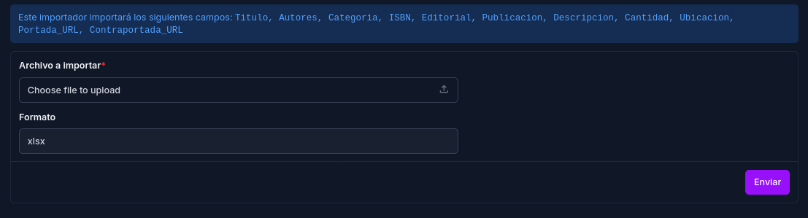
*Figura 10. Formulario de importación con la indicación de los campos que serán procesados y el selector de archivo.*

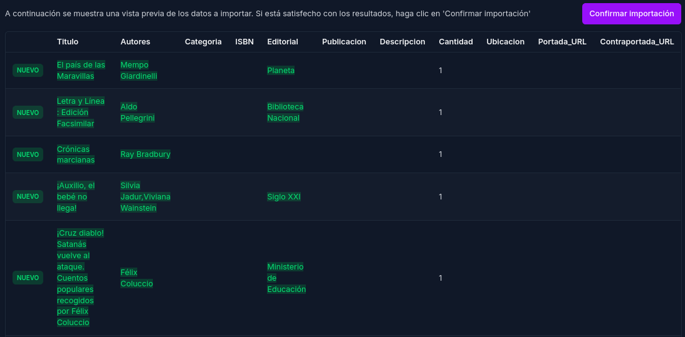
*Figura 11. Vista previa generada tras cargar el archivo, con los registros a importar identificados como nuevos.*

### 9.6 Flujo de exportación

Para exportar el catálogo, el bibliotecario accede al listado de libros en el panel de administración y hace clic en el botón **Exportar Excel**. El sistema presenta un formulario que confirma el formato de exportación (xlsx) y los campos que serán incluidos en el archivo. Al hacer clic en **Enviar**, el navegador descarga automáticamente el archivo generado. Si el bibliotecario aplicó filtros en el listado de libros antes de iniciar la exportación, el archivo descargado contendrá únicamente los registros que cumplen dichos criterios.

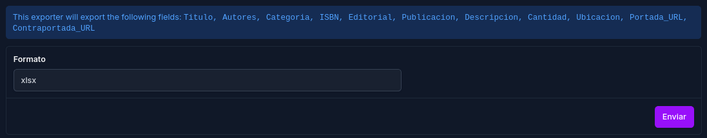
*Figura 12. Formulario de exportación con la indicación de los campos que serán incluidos en el archivo descargado.*

---

*Este documento corresponde al estado del proyecto a la fecha indicada en la carátula. El desarrollo continúa y esta documentación será extendida en entregas posteriores a medida que se incorporen nuevas funcionalidades al sistema.*
